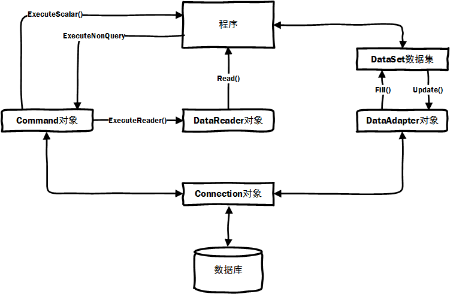

ADO.net 五大对象简介(程序集`System.Data`,命名空间`System.Data`,`System.Data.SqlClient`)

* Connection对象(`DbConnection`,`SqlConnection`)

  建立与特定数据源的连接。 所有 Connection 对象的基类均为 DbConnection 类，是所有数据库操作的基础，在对数据库操作之前要先建立数据连接。

* Command对象(`DbCommand`,`SqlCommand`)

  对象定义了将对数据源执行的指定命令。 表示要对数据库执行的一个 Transact-SQL 语句或存储过程。所有 Command 对象的基类均为 DbCommand 类。

* DataReader对象(`DbDataReader`,`SqlDataReader`)

  从数据源中读取只进且只读的数据流。 所有 DataReader 对象的基类均为 DbDataReader 类，DataReader对象只允许以只读、顺向的方式查看其中所存储的数据，提供一个非常有效率的数据查看模式，同时DataReader对象还是一种非常节省资源的数据对象。

* DataSet对象(`DataSet`)

  驻留于内存的数据集，可以看做是内存中的数据库，内部用XML来描述数据。 也因此可以说DataSet是数据表的集合，它可以包含任意多个数据表（DataTable), 独立于各种数据源。

* DataAdapter对象(`DbDataAdapter`,`SqlDataAdapter`)

  DataAdapter对象充当DataSet和数据源之间用于检索和保存数据的桥梁。DataAdapter类代表用于填充DataSet以及更新数据源的一组数据库命令和一个数据库连接。表示一组 SQL 命令和一个数据库连接，它们用于填充 DataSet 和更新数据源。

[数据库访问类简单Demo](../Code/DbLink.cs)